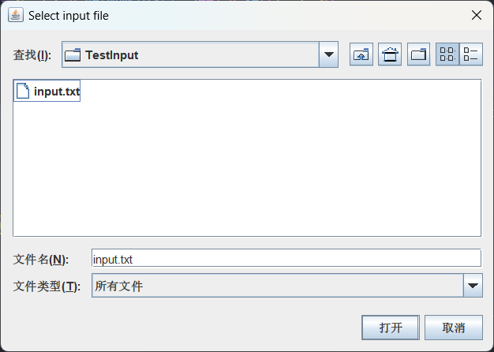
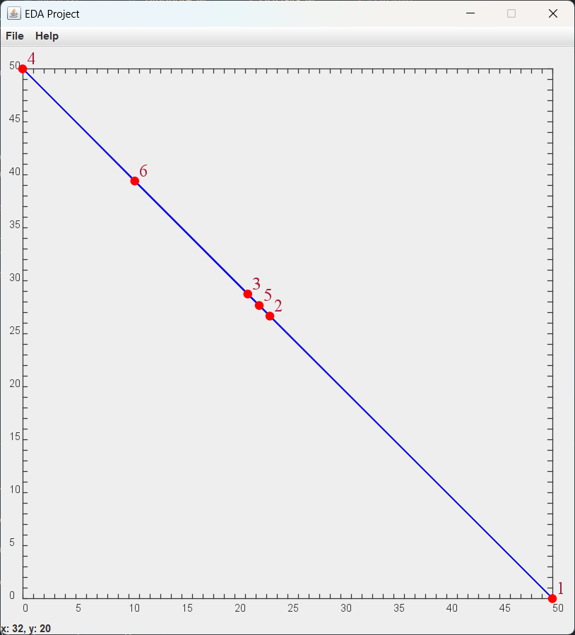
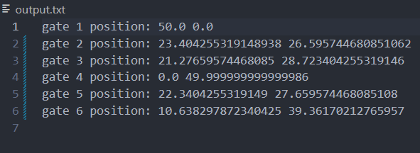
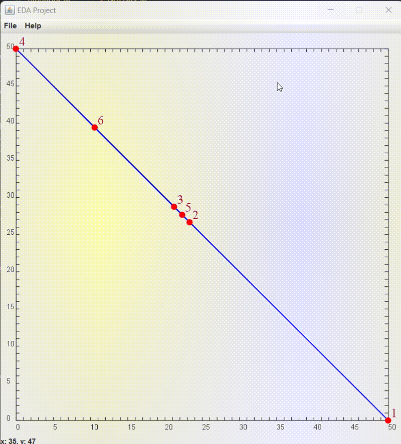

## Introduction
This is a `Java` program for layout planning in EDA physical design. It parses the input netlist file, generates the layout planning result, and implements visual display.

## Problem Description
For the given connection relationship and weight between gates, pad position, it is required to generate a layout plan to minimize the total weight of the layout plan.

## Algorithm Design

First, we use an `n*n` adjacency matrix to represent the connection relationship between gates (including pads). The element `C[i][j]` in the adjacency matrix represents the connection weight between gate `i` and gate `j`. For the convenience of calculation (to be improved), it is assumed that the weight is 1, that is, `C[i][j] = 1` represents the connection between gate `i` and gate `j`, and `C[i][j] = 0` represents no connection between gate `i` and gate `j`.

Next, we use an `n*2` matrix to represent the position information of the pads. The element `B[i][0]` in the matrix represents the abscissa of the `i`-th pad, and `B[i][1]` represents the ordinate of the `i`-th pad. If `i` is not a pad, then `B[i][0] = B[i][1] = 0`.

Then, according to the adjacency matrix `C` and the pad position information `B`, we construct a matrix `A`, the calculation method is as follows:

1. Initialize `A` as an `n*n` matrix
2. For the row `i` representing the pad: 
  + `A[i][j] = 1` if `j == i`
  + `A[i][j] = 0` if `j != i`  
3. For other rows `i`: 
  + `A[i][j] = sum(C[i][j] for j in range(n))` if `i==j`
  + `A[i][j] = -C[i][j]` if `i!=j`

```java
for (int i = 0; i < A.getNumRows(); i++)
    for (int j = 0; j < A.getNumCols(); j++)
        if (i == j) A.set(i, j, addRow(C, i));
else A.set(i, j, -C.get(i, j));

for (int i = 0; i < A.getNumRows(); i++)
    if (B.get(i, 0) != 0 || B.get(i, 1) != 0) {
        for (int j = 0; j < A.getNumCols(); j++) A.set(i, j, 0);
        A.set(i, i, 1);
    }
```

Finally, calculate the position information of the gate matrix: $G=A^{-1}B$, where `G` is an `n*2` matrix, and the element `G[i][0]` represents the abscissa of the `i`-th gate, and `G[i][1]` represents the ordinate of the `i`-th gate.

## GUI Design

Read input netlist file
<p align="center">
    
</p>

Visualize the output result
<p align="center">
    
</p>

At the same time, output the result to the file `output.txt`
<p align="center">
    
</p>

Other functions: display the coordinates corresponding to the current mouse position in the status bar

## Usage

[Annimation](https://github.com/Jupiter2143/EDAProject)
<p align="center">
    
</p>

## Compilation
This `java` program uses the third-party library [EJML](https://ejml.org/)(Efficient Java Matrix Library), please make sure that the library has been installed.

Compile `java` files by yourself.

## Code Structure
| File Name   | Description               |
| ----------- | ------------------------- |
| `Main.java` | Entrance of the program   |
| `EDA.java`  | Main logic of the program |
| `GUI.java`  | GUI design of the program |